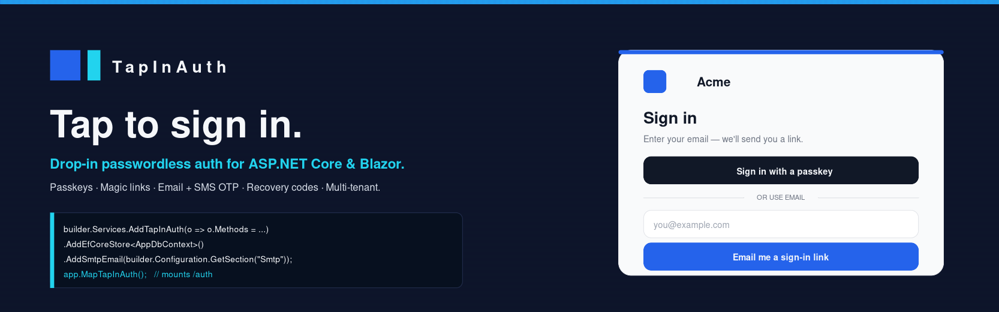

<div align="center">



<h1>TapInAuth</h1>

**Tap to sign in.** Drop-in passwordless authentication for ASP.NET Core and Blazor.
Passkeys · Magic links · Email + SMS OTP · Recovery codes · Multi-tenant from row 1.

[](https://github.com/isureshsubramanian/TapInAuth/actions/workflows/ci.yml)
[](https://www.nuget.org/packages/TapInAuth.AspNetCore)
[](LICENSE)
[](https://dotnet.microsoft.com)
[](CONTRIBUTING.md)

[**Quickstart**](#5-line-quickstart) · [**Docs**](docs/getting-started.md) · [**Samples**](samples/) · [**Why TapInAuth?**](#why-tapinauth)

</div>

---

## What you get

Five passwordless methods, plus bot defense. Mix any combination via a single `Methods` flags enum — TapInAuth wires the UI and endpoints to match.

| Method | Status | Package |
|---|---|---|
| 🔑 **Passkeys** (WebAuthn / FIDO2) | ✅ shipping | `TapInAuth.Core` (wraps `Fido2.AspNet`) |
| 📧 **Magic link** (email) | ✅ shipping | `TapInAuth.Core` |
| 🔢 **Email OTP** (6-digit code) | ✅ shipping | `TapInAuth.Core` |
| 📱 **SMS OTP** (phone as secondary identifier) | ✅ shipping | `TapInAuth.Core` + `TapInAuth.Sms.Twilio` |
| 🔄 **Recovery codes** (single-use) | ✅ shipping | `TapInAuth.Core` |
| 🤖 **Bot defense** (Turnstile / hCaptcha) | ✅ shipping | `TapInAuth.Risk.Turnstile`, `TapInAuth.Risk.HCaptcha` |

Plus a Razor Pages UI **and** a Razor Components (Blazor Server) UI you can ship as-is or restyle with CSS variables, a tenant-aware EF Core store, an ASP.NET Core Identity adapter for existing apps, a built-in admin dashboard with audit feed, **five email providers** (SMTP, SendGrid, Postmark, Amazon SES, MessageBird) behind a single `IEmailSender` contract, and an MIT license.

## 5-line quickstart

```csharp
// Program.cs
builder.Services
    .AddTapInAuth(o =>
    {
        o.Logo.Path    = "wwwroot/img/your-logo.svg";
        o.Theme.Accent = "#2563EB";
        o.Methods      = TapInAuthMethod.Passkey
                       | TapInAuthMethod.MagicLink
                       | TapInAuthMethod.EmailOtp
                       | TapInAuthMethod.RecoveryCode;
    })
    .AddEfCoreStore<AppDbContext>()
    .AddSmtpEmail(builder.Configuration.GetSection("Smtp"));

app.UseAuthentication();
app.UseAuthorization();
app.MapRazorPages();          // surfaces TapInAuth.UI's sign-in / OTP / passkeys / recovery / account / admin pages
app.MapTapInAuth();           // mounts /auth/* endpoints
```

That's the entire host-app surface. Sign-in page, magic-link landing, OTP entry, passkey ceremony, recovery flow, account self-service, audit dashboard — all in the library, all themed to your `--tap-accent`.

## The UI is in the package

The bit other libraries skip. You don't write the sign-in page; you don't draw the OTP boxes; you don't style the "we sent you a link" landing. TapInAuth ships an executive-grade UI as a Razor Class Library, themed via CSS variables. Drop in your logo, pick an accent color, done.

<table>
<tr>
<td width="50%" valign="top">

**`TapInAuth.UI`** — Razor Pages

- `/auth/sign-in` · passkey button + magic-link + OTP + SMS forms
- `/auth/otp` · `/auth/sms-otp` · segmented code-entry pages
- `/auth/sent` · "we sent you a link" landing
- `/auth/recovery` · rescue path when the device is gone
- `/auth/account` · phone management, signed-in self-service
- `/auth/admin/*` · audit feed (role-gated)

</td>
<td width="50%" valign="top">

**`TapInAuth.UI.Blazor`** — Razor Components

- Same routes, rendered as `InteractiveServer` components
- `<TapInAuthCard Title="..." />` reusable shell
- Cascading auth state — pages auto-hide when anonymous
- Per-tenant `ITenantResolver`-driven theming
- Drop-in alongside an existing Blazor Server app

</td>
</tr>
</table>

Both UIs share the same design tokens (`--tap-accent`, `--tap-radius`, `--tap-card-radius`, `--tap-font`, dark/light pairs for `--tap-bg` / `--tap-surface`). Per-tenant overrides come from `ITenantResolver.ThemeAccent` / `LogoPath` — branding follows the tenant context automatically.

> 📸 Screenshots: drop captures into `docs/images/screenshots/` and reference them here. Suggested set: signed-out sign-in (light + dark), OTP entry, passkey ceremony, account page, admin audit feed, three-tenant brand comparison.

## Already on ASP.NET Core Identity?

Swap one builder call:

```csharp
builder.Services.AddTapInAuth(...)
    .AddEfCoreStore<AppDbContext>()       // still hosts magic-link, OTP, recovery, passkey tables
    .AddIdentityAdapter<IdentityUser>()   // user table → Identity's AspNetUsers
    .AddSmtpEmail(...);
```

No second user table. `UserManager<IdentityUser>` runs the user side; TapInAuth runs everything else. See [`samples/Identity.Sample`](samples/Identity.Sample) for the end-to-end demo.

## Multi-tenant SaaS?

Tenancy is built in from row 1 — every store call is tenant-scoped, and the EF store enforces tenant-aware filtered unique indexes. Add a resolver, point it at your tenant catalog, optionally override per-tenant logo / accent / WebAuthn RP id:

```csharp
builder.Services.AddTapInAuth(...)
    .AddEfCoreStore<AppDbContext>()
    .AddTenantResolver<MySubdomainTenantResolver>()
    .AddSmtpEmail(...);
```

See [`samples/SaaS.MultiTenant`](samples/SaaS.MultiTenant) for the three-tenant demo with per-tenant logos, brand colors, credential isolation, and a claim-vs-tenant guard that fails closed on stale cookies.

## Provider freedom, not lock-in

Single `IEmailSender` / `ISmsSender` / `IRiskSignalProvider` contracts behind every provider. Swap in one line.

| Channel | Providers |
|---|---|
| 📧 Email | `TapInAuth.Email.Smtp` (MailKit) · `TapInAuth.Email.SendGrid` · `TapInAuth.Email.Postmark` · `TapInAuth.Email.Ses` (AWS SES v2) · `TapInAuth.Email.MessageBird` |
| 📱 SMS | `TapInAuth.Sms.Twilio` |
| 🛡️ Bot defense | `TapInAuth.Risk.Turnstile` · `TapInAuth.Risk.HCaptcha` |

## Security defaults

The library matches the OWASP passwordless cheat sheet without you having to think about it.

- **HMAC-SHA256 hashed tokens** with a per-instance pepper — raw tokens never persisted
- **Constant-time comparisons** (`CryptographicOperations.FixedTimeEquals`) on every redemption
- **Single-use redemption** — magic links and OTPs are atomically consumed on success
- **Per-identifier rate limits** on both issuance AND verification
- **Per-OTP attempt counters** — exhausted attempts consume the code
- **No enumeration leak** — unknown emails and phones return the same response shape as known ones
- **Structured audit log** piped to a built-in admin dashboard
- **Cookie handoff** to the host's existing auth scheme — TapInAuth never issues its own session cookie

## Why TapInAuth?

|  | TapInAuth | fido2-net-lib | ASP.NET Core Identity passkeys | Bitwarden Passwordless.dev |
|---|---|---|---|---|
| Passkeys (WebAuthn) | ✅ | ✅ (protocol only) | ✅ (Blazor template only) | ✅ (SaaS, $3/user/mo) |
| Magic link | ✅ | ❌ | ❌ | ❌ |
| Email / SMS OTP | ✅ | ❌ | ❌ | ❌ |
| Recovery codes | ✅ | ❌ | ❌ | ❌ |
| Built-in UI, themable | ✅ | ❌ | template only | hosted widget |
| Admin dashboard + audit log | ✅ | ❌ | ❌ | ✅ |
| Multi-tenant from day one | ✅ | n/a | ❌ | ✅ |
| ASP.NET Core Identity adapter | ✅ | n/a | n/a | n/a |
| OSS, self-hosted, no SaaS | ✅ | ✅ | ✅ | open-core |

## Documentation

| | |
|---|---|
| [Getting started](docs/getting-started.md) | Add TapInAuth to a fresh or existing ASP.NET Core app |
| [Concepts: multi-tenancy](docs/concepts-multi-tenancy.md) | Tenant resolution, per-tenant branding, isolation guarantees |
| [Concepts: cookie handoff](docs/concepts-cookie-handoff.md) | How TapInAuth cooperates with `AddAuthentication().AddCookie()` |
| [How-to: ASP.NET Core Identity adapter](docs/howto-identity-adapter.md) | Plug into an existing `IdentityUser` setup |
| [How-to: passkeys](docs/howto-passkeys.md) | WebAuthn config, RP id, conditional UI |
| [How-to: recovery codes](docs/howto-recovery-codes.md) | Generation, redemption, UX patterns |
| [How-to: admin dashboard](docs/howto-admin-dashboard.md) | Granting the admin role, audit feed |
| [How-to: theming](docs/howto-theming.md) | Design tokens, logo handling, dark/light mode |
| [How-to: SMS sign-in](docs/howto-sms-signin.md) | Phone as secondary identifier, account-page management |
| [Reference: options](docs/reference-options.md) | Every `TapInAuthOptions` knob |
| [Reference: endpoints](docs/reference-endpoints.md) | Every HTTP endpoint mounted by `MapTapInAuth()` |
| [Reference: email providers](docs/reference-email-providers.md) | SMTP / SendGrid / SES / Postmark / MessageBird |
| [Releasing](docs/RELEASING.md) | Runbook for cutting a NuGet release |
| **Deploy** | [Azure](docs/deployment/azure.md) · [AWS](docs/deployment/aws.md) · [Docker](docs/deployment/docker.md) · [Kubernetes](docs/deployment/kubernetes.md) · [IIS](docs/deployment/iis.md) |

## Repository layout

```
src/
  TapInAuth.Abstractions/               Interfaces, DTOs, options
  TapInAuth.Core/                       Auth engine (magic link, OTP, SMS OTP, passkeys, recovery, hashing, rate limit, audit)
  TapInAuth.AspNetCore/                 DI extensions, endpoint mapping, cookie handoff, admin policy
  TapInAuth.Identity/                   ASP.NET Core Identity adapter
  TapInAuth.Store.EntityFrameworkCore/  EF Core store (tenant-aware) + EF audit sink
  TapInAuth.Email.Smtp/                 MailKit-based IEmailSender
  TapInAuth.Email.SendGrid/             SendGrid IEmailSender
  TapInAuth.Email.Ses/                  Amazon SES (v2) IEmailSender
  TapInAuth.Email.Postmark/             Postmark IEmailSender
  TapInAuth.Email.MessageBird/          MessageBird (Bird) IEmailSender
  TapInAuth.Sms.Twilio/                 Twilio ISmsSender
  TapInAuth.Risk.Turnstile/             Cloudflare Turnstile bot-defense
  TapInAuth.Risk.HCaptcha/              hCaptcha bot-defense
  TapInAuth.UI/                         Razor Pages UI (RCL) — sign-in, OTP, passkeys, recovery, account, admin
  TapInAuth.UI.Blazor/                  Razor Components UI (Blazor Server / interactive)

samples/
  Mvc.Quickstart/                       Single-tenant MVC app with all methods
  Identity.Sample/                      ASP.NET Core Identity + TapInAuth coexistence
  SaaS.MultiTenant/                     SaaS demo: subdomain tenants, per-tenant logo + theme
  BlazorServer.Quickstart/              Blazor Server app using TapInAuth.UI.Blazor

tests/
  TapInAuth.Abstractions.Tests/
  TapInAuth.Core.Tests/
  TapInAuth.AspNetCore.Tests/
```

## Building locally

Prerequisites: .NET SDK **10.0.300+** (`global.json` enforces).

```bash
git clone https://github.com/isureshsubramanian/TapInAuth.git
cd TapInAuth
dotnet restore
dotnet build -c Release
dotnet test  -c Release
dotnet run   --project samples/Mvc.Quickstart
```

The samples include [Hermex](https://github.com/isureshsubramanian/Hermex) — an in-process dev SMTP server with a browser inbox at `/hermex` — so you can sign in via magic-link or OTP without configuring real SMTP.

## Roadmap

- **v0.6** (next 4 weeks): comprehensive test suite, MessageBird & SNS SMS senders, OpenAPI metadata
- **v0.9** (pre-1.0): OIDC bridge (be an identity provider), admin dashboard polish, i18n / RTL
- **1.0**: .NET Foundation incubation, production-grade docs site, trademark + governance

## Contributing

See [CONTRIBUTING.md](CONTRIBUTING.md). All commits must be signed off (DCO — `git commit -s`).

## Security

See [SECURITY.md](SECURITY.md) for the threat model and how to report vulnerabilities.

## License

MIT — see [LICENSE](LICENSE). Trademark "TapInAuth" is held by Suresh Subramanian; the open-source license does not grant a trademark license.
